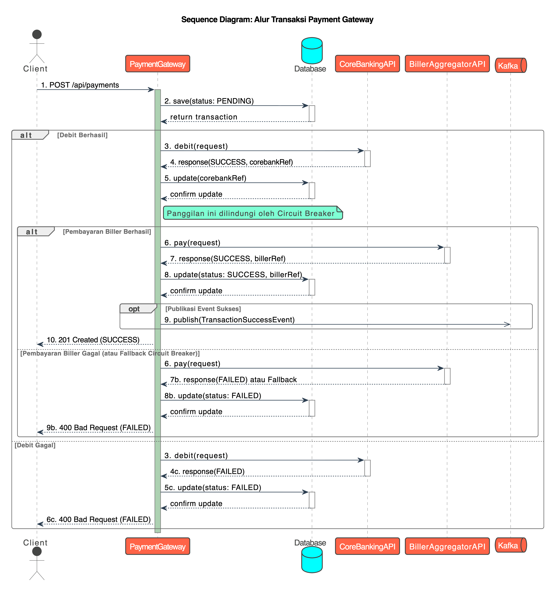

# Payment Gateway Service

Proyek ini adalah implementasi dari sebuah layanan Payment Gateway sebagai bagian dari *Coding Test - Java Backend Developer*.

## Deskripsi
Layanan ini dibangun menggunakan **Spring Boot** dan dirancang untuk berfungsi sebagai perantara yang mengorkestrasi alur transaksi pembayaran. Ia dapat menerima permintaan dari berbagai channel (Mobile Banking, ATM, dll.), melakukan proses debit ke sistem perbankan inti, dan meneruskan permintaan pembayaran ke Biller Aggregator.

Sistem ini juga dilengkapi dengan fitur-fitur modern yang tangguh, termasuk:
- **Keamanan**: Otentikasi berbasis **JWT** untuk semua endpoint bisnis.
- **Resilience**: Pola **Circuit Breaker** (menggunakan Resilience4j) untuk menangani kegagalan pada layanan eksternal.
- **Arsitektur Asinkron**: Publikasi *event* ke **Apache Kafka** setelah transaksi berhasil untuk diproses oleh layanan lain (*downstream services*).
- **Containerization**: Siap dijalankan di mana saja menggunakan **Docker** dan **Docker Compose**.

## Arsitektur & Alur Kerja
Berikut adalah diagram sekuens yang menggambarkan alur transaksi pembayaran utama:



## Teknologi yang Digunakan
- **Framework**: Spring Boot 3.5.6
- **Bahasa**: Java 21
- **Keamanan**: Spring Security 6 (Otentikasi JWT)
- **Database**: PostgreSQL dengan Spring Data JPA (Hibernate) & Flyway (untuk migrasi)
- **Integrasi**:
  - Spring Cloud OpenFeign (REST Client)
  - Resilience4j (Circuit Breaker)
  - Apache Kafka (Message Broker)
- **Dokumentasi**: Swagger/OpenAPI v3 (springdoc-openapi)
- **Pengujian**: JUnit 5, Mockito, Testcontainers, H2 Database
- **Container**: Docker & Docker Compose
- **Build Tool**: Maven

## Prasyarat
- Java 21
- Docker & Docker Compose
- Maven

## Cara Menjalankan Aplikasi
Cara termudah dan direkomendasikan untuk menjalankan keseluruhan aplikasi beserta semua layanannya (PostgreSQL & Kafka) adalah dengan menggunakan Docker Compose.

1.  **Clone Repositori Ini**
    ```bash
    git clone https://github.com/frddyy/payment-gateway-cip.git
    cd payment-gateway
    ```

2.  **Pastikan Docker Berjalan**
    Buka aplikasi Docker Desktop di mesin Anda.

3.  **Jalankan Docker Compose**
    Buka terminal di direktori *root* proyek dan jalankan perintah berikut. Perintah ini akan membangun *image* untuk aplikasi dan menjalankan semua *container* yang dibutuhkan.
    ```bash
    docker compose up --build
    ```
    Tunggu beberapa saat hingga semua layanan berjalan. Aplikasi akan tersedia di `http://localhost:8080`.

## Dokumentasi & Pengujian API
Dokumentasi API yang interaktif dan lengkap tersedia melalui Swagger UI.

- **URL Swagger UI**: [http://localhost:8080/swagger-ui.html](http://localhost:8080/swagger-ui.html)

### Cara Menguji Endpoint yang Diamankan
1.  **Dapatkan Token Tes**: Untuk mendapatkan token JWT, akses endpoint tes berikut (misalnya via browser):
    `GET http://localhost:8080/api/test/token/{username}`
    Ganti `frddyy` dengan username pilihan Anda. Copy string token yang dihasilkan.

2.  **Atur Otorisasi**: Di halaman Swagger UI, klik tombol hijau **"Authorize"**. Di dialog yang muncul, masukkan `Bearer <token_anda>` (kata `Bearer`, spasi, lalu token yang sudah Anda copy). Klik "Authorize".

3.  **Jalankan Skenario**: Sekarang Anda bisa menjalankan semua skenario tes, termasuk:
    * **Skenario Sukses**: Gunakan request body standar.
    * **Skenario Gagal Debit**: Gunakan `account` yang mengandung kata `fail`.
    * **Skenario Gagal Biller**: Gunakan `orderId` yang mengandung kata `fail`.

## Konfigurasi
Konfigurasi utama aplikasi terdapat di `src/main/resources/application.properties`. Untuk menjalankan dengan Docker, beberapa properti (seperti URL database dan Kafka) akan di-override oleh *environment variables* yang didefinisikan di `docker-compose.yml` untuk memastikan komunikasi antar-container berjalan lancar. File `application.properties.example` disediakan sebagai template konfigurasi.